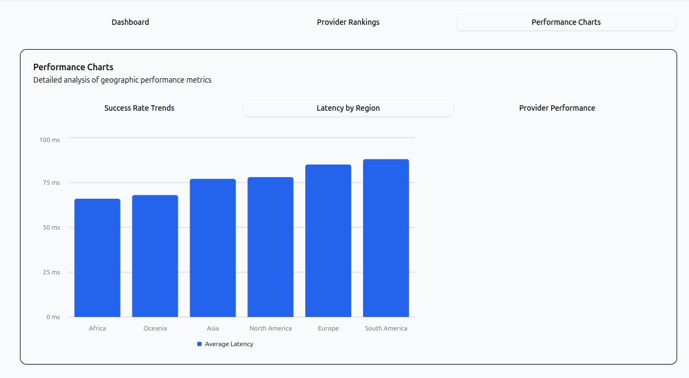

# GeoSpark: Geographic Performance Analyzer for Filecoin Storage Providers

## Overview

GeoSpark is a Checker Network subnet that analyzes and maps the geographic performance of Filecoin storage providers. By collecting latency, throughput, and retrieval success metrics from different global regions, it helps clients choose optimal providers for their target users and regions.

Unlike general-purpose retrieval checkers, GeoSpark focuses specifically on geographic performance optimization, providing recommendations based on location-specific metrics.

## Features

- **Geographic Performance Testing**: Tests Filecoin retrievals from the checker's location, recording metrics like latency, time-to-first-byte (TTFB), and throughput
- **Provider Geolocation Analysis**: Recommends providers based on continent and country-specific performance
- **Visual Performance Mapping**: Organizes performance data by geographic region
- **Intelligent Provider Selection**: Automatically selects and tests region-optimized storage providers
- **Network Health Monitoring**: Tracks success rates across different geographic areas
- **Performance Recommendations**: Generates actionable recommendations based on geographic analysis

## Architecture

The project consists of two main components:

1. **Geo-Filecoin Checker Subnet**: A Zinnia-based checker module that runs tests and collects geographic performance data
2. **Simple-Subnet API**: A modified version of the Checker Network API that stores and serves geographic performance data
3. **Dashboard**: A web application that displays geographic performance data and recommendations

- A Visual Representation of how the subnet works


## How It Works

1. **Location Detection**: The checker determines its own geographic location using IP geolocation
2. **Provider Selection**: It identifies Filecoin providers optimized for its geographic region
3. **Performance Testing**: For each provider, it runs retrieval tests and collects performance metrics
4. **Data Analysis**: It aggregates data by geographic region and identifies performance patterns
5. **Recommendation Generation**: Based on the collected data, it generates provider recommendations
6. **Data Submission**: Measurements are submitted to the Simple-Subnet API for storage and trend analysis

## Metrics Collected

- **Success Rate**: Percentage of successful retrievals
- **Latency**: Time from request to completion
- **TTFB (Time To First Byte)**: Time until initial data received
- **Throughput**: Data transfer rate in bytes per second
- **Geographic Context**: Continent, country, and city information

## Installation

### Prerequisites

- Node.js 18+
- Docker (for running PostgreSQL database)
- Zinnia CLI

### Setup

1. Clone the repository:
   ```bash
   git clone https://github.com/Gmin2/GeoSpark.git geo-filecoin
   cd geo-filecoin
   ```

2. Initialize and update the submodule:
   ```bash
   git submodule update --init --recursive
   ```

3. Set up the database:
   ```bash
   # Start PostgreSQL in Docker
   docker run -d --name geo-filecoin-db \
     -e POSTGRES_HOST_AUTH_METHOD=trust \
     -e POSTGRES_USER=$USER \
     -e POSTGRES_DB=$USER \
     -p 5433:5432 \
     postgres

   # Create the application database
   psql postgres://$USER@localhost:5433/$USER -c 'CREATE DATABASE simple_subnet_api'
   ```

4. Configure the Simple-Subnet API:
   ```bash
   cd simple-subnet-api
   echo "DATABASE_URL=postgres://$USER@localhost:5433/simple_subnet_api" > .env
   npm install
   npm run migrate
   cd ..
   ```

## Usage

### Running the Subnet

To run both the Simple-Subnet API and the Geo-Filecoin subnet:

```bash
# Start the API server
cd simple-subnet-api
npm start

# In another terminal, start the checker subnet
cd geo-filecoin
zinnia run main.js
```

### Querying Results

Once data has been collected, you can query the results:

```bash
# Get overall success rate
curl "http://localhost:8080/geo-filecoin/retrieval-success-rate"

# Get region-specific stats
curl "http://localhost:8080/geo-filecoin/stats?continent=Asia"

# Get provider-specific stats
curl "http://localhost:8080/geo-filecoin/stats?minerId=f01234567"
```

### Dashboard

Once the api is running, you can access the dashboard at http://localhost:5173/





## Customization  

### Config Options

The subnet's behavior can be customized by editing `lib/config.js`:

```javascript
export default {
  // Test CID to retrieve
  testCid: 'bafkreifzjut3te2nhyekklss27nh3k72ysco7y32koao5eei66wof36n5e',
  
  // How often to run checks
  checkInterval: 5 * 60 * 1000, // 5 minutes
  
  // Known providers for different regions
  knownPeers: [
    {
      minerId: 'f0frisbii',
      peerId: '12D3KooWC8gXxg9LoJ9h3hy3jzBkEAxamyHEQJKtRmAuBuvoMzpr',
      region: null // Works globally
    },
    // Add region-specific providers here
  ]
}
```

## Development

### Adding New Metrics

To collect additional metrics:

1. Add the new metric to the measurement function in `lib/measure.js`
2. Update the schema in `simple-subnet-api/lib/subnet-routes.js`
3. Add the new field to the `geo_measurements` table

### Adding Regional Providers

To add known good providers for specific regions:

1. Add the provider details to the `knownPeers` array in `lib/config.js`
2. Specify the region (continent) for optimal targeting

## Testing

Run the test suite with:

```bash
zinnia run test.js
```

## Integration with Checker Network

This subnet can be integrated with the main Checker Network by:

1. Implementing the Checker Network protocol
2. Submitting measurement data to the central API
3. Allowing other Checker nodes to access geographic performance data

## Future Work

- **Global Performance Map**: Visual representation of global performance metrics
- **Provider Ranking System**: Score providers based on regional performance
- **Multi-location Testing**: Coordinate testing from multiple geographic locations
- **Time-based Analysis**: Track performance changes over time of day/week
- **Custom CDN Recommendations**: Suggest optimal CDN configurations based on geographic data


---

Created as part of the Checker Network Hackathon to improve geographic performance optimization for the Filecoin network.